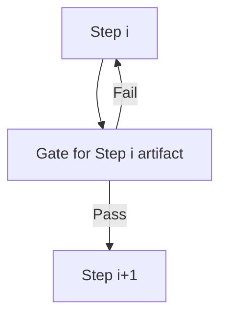
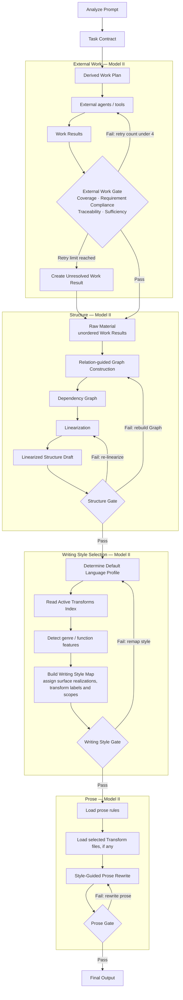

# Writing Style Optimization：模型架构

## 0. 范围

本系统只控制自然语言输出的任务识别、信息交接、结构重建、写作方式选择和 prose realization。检索、计算、推理与 agent 协作负责产生内容；本 Skill 只规定它们与写作流程的接口。

本文是架构，不是最终 `SKILL.md`。`architecture-revised.md` 保留为上一轮批注记录。

参考：本项目已确认的范围；`academic-writing-skills/skills/academic-writing-skills/SKILL.md` 的 “Route the Task” 与 lifecycle/overlay 分离。

## 1. 两种基本处理模型

### Model I：Direct Pass

一个步骤完成产物后，不经过本地质量回路，直接交给下一步骤：


Model I 用于不需要质量判定的阶段连接或阶段内部转换。例如：External Work Gate 结束后，Work Results 汇入 Raw Material；Dependency Graph 完成后直接进入 Linearization。

### Model II：Gate Check Loop

一个步骤产生需要验证的 artifact；Gate 通过后才能交付，失败则回到该步骤重做：



Gate 是 `Step i` 的末端子步骤，不属于 `Step i+1`。它只检查 `Step i` 负责的 artifact，Fail 只返回 `Step i`。如果下游 Gate 经常返回更早阶段，说明上游 Gate 的责任边界没有定义完整。

本架构使用四个 Model II：External Work、Structure、Writing Style Selection 和 Prose。其余连接使用 Model I。

参考：本项目本轮确认的控制流；`academic-writing-skills/skills/academic-writing-skills/references/lifecycle-and-routing.md` 的 Stage Gates 只提供 gate 设计参考。

## 2. 总体流程



写作主线向后交接的核心 artifact 为：`Task Contract → Raw Material → Dependency Graph → Linearized Structure Draft → Writing Style Map → Final Output`。Task Contract 先驱动 Derived Work Plan、Work Results 与 External Work Gate；后续各生产阶段各自闭环，不建立跨阶段的常规回退边。

## 3. Analyze Prompt 与 Derived Work

### 3.1 Task Contract

Analyze Prompt 识别最终输出必须完成什么，并形成 Task Contract。Contract 只定义任务及其输入，不定义段落或语义结构。它分为 `Problem Specification` 与 `Context Specification`：

```text
Task Contract
├─ Problem Specification
│  ├─ Requested Objectives
│  ├─ Derived Work Items
│  ├─ Structure Readiness Conditions
│  ├─ Task Relations
│  ├─ Requirement Routing
│  └─ Deliverables
│     └─ Deliverable Contract
└─ Context Specification
   └─ Input Inventory
```

参考：`academic-writing-skills/skills/academic-writing-skills/SKILL.md` 的 “Route the Task”“Governing Principle”与 locked decisions；字段经过本项目的任务层重划分。

### 3.2 Problem Specification

#### Requested Objectives

`Requested Objective` 是最终回复必须实现的用户可见内容结果。它说明需要回答、判断、解释、修改或产生什么，但不规定求解方法、内部工作步骤或输出结构。Objective 应保持足够通用，使 AI 能自行分析和拆解任务。

#### Derived Work Items

`Derived Work Item` 是为完成一个或多个 Requested Objectives 而产生的、可以独立执行并返回结果的内部工作单元。它采用开放定义，不使用封闭的任务 taxonomy；文本分析、外部检索、计算、比较、核验、内容转换和多结果综合只作为可能实例。

每个 Work Item 只记录：

```text
work item id
objective links
operation
required result
```

Derived Work Item 不自动成为最终输出的章节或组成部分。

#### Structure Readiness Conditions

每个 Requested Objective 有一个 Structure Readiness Condition。它位于 Derived Work Items 之后，记录该 Objective 下的内部工作是否已经产生结果，并作为 External Work Gate 的 Coverage 检查依据。

对 Objective $O_i$，设 $W(O_i)$ 为链接到它的 Derived Work Items，$R$ 为当前 Work Results。其条件为：

$$
C_i=\bigwedge_{w\in W(O_i)}\exists r\in R:\;w\in\operatorname{WorkItemLinks}(r).
$$

因此 Condition 只记录 `objective link + true / false`，不重复 Work Result 的内容。达到重试上限后生成的 Unresolved Work Result 也属于 Work Result，可以关闭相应 Work Item 的记录缺口。Condition 为 true 只表示该 Objective 的所有既定 Work Items 均已有结果状态，不表示 Objective 已在最终输出中完成，也不替代 Gate 的全局 Sufficiency Check。

#### Task Relations

Task Relations 只记录 task-level relations：

```text
containment
dependency
parallel
shared-input
conflict
alternative
```

这里不记录 cause、evidence、contrast、qualification 等 semantic relations；后者属于 Structure 的 Dependency Graph。

#### Requirement Routing

Analyze Prompt 识别完成任务时需要遵循的要求，并把它们交给实际负责的阶段。每项只记录：

```text
requirement
strength: hard / soft
target stages
objective links
```

`hard` requirement 必须满足，不满足会使目标阶段的 Gate 失败；`soft` requirement 是优化目标，在与 hard requirement、事实准确性或信息保真冲突时可以让步。Requirement 的来源解释和 strength 判断由 Analyze Prompt 完成，不保留独立 `source` 标签。

Requirement 根据作用被路由至 External Work、Structure、Writing Style Selection、Prose 或最终交付检查。用户明确指定的文体要求必须在这里记录并传给 Writing Style Selection，但 Analyze Prompt 不执行该文体。

#### Deliverables 与 Deliverable Contract

Deliverable Contract 属于实际 `Deliverable`，不属于 Objective 或 Work Item。Objective 定义需要实现的内容结果；Work Item 定义内部求解工作；Deliverable 定义承载一个或多个 Objectives 的外部交付物。

具有相同 `artifact / audience / carrier / granularity` 的 Objectives 共用一个 Deliverable。只有用户要求多个独立文件、修改结果或其他输出时，才建立多个 Deliverables。每个 Deliverable Contract 记录：

```text
deliverable id
objective links
artifact
audience
carrier
granularity
explicit deliverable slots  # optional; only when explicitly required
```

`artifact` 只表示交付物类别，例如 response、assessment、report、revised text 或 file；它不重复 Objective 的内容。`explicit deliverable slots` 只保存用户明确要求的可见组成部分，不承担 Objective 的完成判定。

用户未指定交付形态时，默认只建立一个 Deliverable：当前对话中的 response，服务全部 user-facing Objectives，granularity 与任务复杂度相称。

### 3.3 Context Specification

Context Specification 只负责区分 Prompt 中的任务与参考信息。它包含 Input Inventory；每个输入条目记录：

```text
input item or pointer
role
authority
objective links
```

`role` 表示信息在任务中的作用，例如 premise、evidence、background、example、object-under-analysis、counterpoint 或 prior decision。`authority` 表示模型可以多大程度依赖它，例如 binding、authoritative-source、user-asserted、supporting、unverified 或 quoted-untrusted。Input Inventory 不设置 `status` 字段。

### 3.4 Derived Work Plan

Task Contract 直接产生 Derived Work Plan。最终 Skill 不为它增加独立 schema，只在 `SKILL.md` 末尾写入一条流程指令：根据 Derived Work Items、required results、Task Relations 与 Structure Readiness Conditions 生成 Derived Work Plan，交给 External agents / tools 执行，并在进入 Structure 前完成 External Work Gate。

搜索只是 Derived Work 的一种。External Work 还可以包括文本分析、计算、比较、核验、内容转换和多结果综合。是否使用 sub-agent、具体模型和 reasoning effort 由运行平台决定，不写入通用 writing rules。

参考：`academic-writing-skills/skills/academic-writing-skills/references/lifecycle-and-routing.md` 的 Project and outline gate 与 evidence route；`Superpowers/skills/brainstorming/SKILL.md` 的任务规模分类只用于确定处理强度。

### 3.5 Work Results、External Work Gate 与 Raw Material

每个 Derived Work Item 执行后产生一个或多个 Work Results。Work Result 的具体内容由 `operation / required result / applicable requirements` 决定，不使用统一的 finding schema。Work Results 与 Work Items 不要求一一对应：一个 Work Item 可以产生多个 Results，一个 Result 也可以链接到多个 Work Items 或 Objectives。每个 Work Result 固定保留：

```text
result payload
generation lineage
work item links
objective links
```

External Work Gate 依次执行三项局部检查和一项全局检查：

- **Coverage**：按 Objective 检查 Structure Readiness Condition，即该 Objective 下每个既定 Work Item 是否至少已有一个链接到它的 Work Result；
- **Requirement Compliance**：检查 `target stages` 包含 External Work 的 requirements 是否满足；
- **Traceability**：检查每个 Work Result 的 Generation Lineage 是否能追溯到其输入，并检查其 Work Item Links 与 Objective Links；
- **Sufficiency**：对全部 Work Results 检查：当前 Results 是否允许 Structure 在不发明新事实或新推导前提的情况下完成所有 Objectives。

Traceability 追踪文本位置、来源、工具输出、计算输入与方法、转换前内容或所依赖的 Work Results，不追踪 hidden chain of thought。冲突可以作为 Work Result 的内容状态保留，不设置独立 Conflict Check。

Gate Fail 后，只把未通过检查的对应 Work Items 重新交给 External agents / tools，不重新生成 Derived Work Plan，也不重复已经通过的 Work Items。每个失败 Work Item 最多执行初次尝试加四次 retry。达到上限仍未通过时，生成带有相同 Attribution 的 Unresolved Work Result，记录未完成状态并结束该项 Gate loop；流程不报错，继续进入 Raw Material。

Raw Material 是全部 Work Results 结束 External Work Gate 后形成的、带有 Generation Lineage、Work Item Links 和 Objective Links 的离散无序结果集合。它可以包含分析、检索、计算、比较、核验、转换、综合和 Unresolved Work Results。这里的“无序”只表示尚未形成 Dependency Graph 或 Presentation Order；已有 links 只承担 Traceability 与 Attribution，不构成 semantic graph。

Raw Material 尚未建立 semantic relations、Dependency Graph、Presentation Order、paragraph functions 或 writing style。Structure 必须从该集合建立语义关系，而不是直接按结果产生顺序输出。

参考：`academic-writing-skills/skills/academic-writing-skills/SKILL.md` 的 Authority、Contract 与 Claim Scope；`academic-writing-skills/skills/academic-writing-skills/references/lifecycle-and-routing.md` 的 evidence dependency。

## 4. Structure

### 4.1 Relation-guided Dependency Graph

Structure 同时接收 Raw Material 与 Task Contract 中面向 Structure 的内容。后者记为：

$$
T_S=\pi_{\mathrm{Structure}}(\text{Task Contract}),
$$

包括 Requested Objectives、Task Relations、`target stages` 包含 Structure 的 requirements，以及 Deliverable Contracts。Structure 的第一步为：

$$
S_1:(M,T_S;\mathcal R)\mapsto D=(U,E,\lambda,H),
$$

其中 $M$ 是 Raw Material，$\mathcal R$ 是开放的 Relation Inventory，输出对象包括：

- $U$：Semantic Units；
- $E$：连接 Semantic Units 的无类型 edge instances；同一对 units 之间允许存在多条 edges；
- $\lambda$：edge-labeling function，为每条 edge 指定 relation type 及两端角色；
- $H$：根据部分 labeled relations 与当前任务推导出的 hard presentation constraints。

S1 沿 Objective Links 审核相关 Raw Material，识别影响内容拆分、连接或排列的语义关系，再依据关系的参与内容与 endpoint roles 确定 Semantic Units。Relation 可以存在于单个 Work Result 内部，也可以跨越多个 Work Results；Work Results 与 Semantic Units 之间不存在固定数量关系。

Semantic Unit 是 Relation 判断在当前 Objectives 下确定的关系参与内容。其边界必须使 unit 与 labeled relations 共同保留原义，并保留 Objective Links 与 Material Links。一个 unit 可以参与多条 relations；多个独立 Objectives 可以形成 disconnected components；简单回答也可以形成只有一个 unit、没有 edge 的退化 Graph。

Relation Inventory 存放在外置 reference 中，并作为开放的判断参考：

$$
\lambda(e)\in\mathcal R_{\mathrm{reference}}\cup\mathcal R_{\mathrm{local}}.
$$

S1 优先采用 reference 中能够保存当前语义的 relation。没有合适定义时，可以为当前 Graph 建立 local relation，并说明 descriptive name、endpoint roles、directionality 与该关系保存的含义。Local relation 不自动写回 Relation Inventory；是否收录为通用 relation 由后续人工审核决定。

$H$ 只保存违反后会破坏理解或任务完成的 hard constraints。Relation 的语义方向不自动等于 Presentation Order：例如 cause–effect 可以标记 cause/effect roles，但允许 result-first 或 cause-first 表达。

参考：`academic-writing-skills/skills/academic-writing-skills/references/lifecycle-and-routing.md` 的 Reader-Function Mapping 与 evidence dependency；`academic-writing-skills/skills/academic-writing-skills/references/universal-integrity.md` 的 relation set 与 claim-scope checks。具体 relation 集合进入 `references/relation-inventory.md`，不在核心流程中封闭列举。

### 4.2 Dependency Graph → Linearized Structure Draft

Linearization 的作用为：

> 将 Dependency Graph 转换为满足 hard presentation constraints 的线性表达，并通过顺序、邻接、分组及必要的关系说明，使 Graph 中的重要 relations 在文本中仍然可以恢复。

记为：

$$
S_2:D\mapsto L,
$$

其中 $L$ 是 Linearized Structure Draft。它已经由基本通顺、可以阅读的语句组成，而不只是 unit IDs 的排列；其结构属性包括 Presentation Order、Semantic Grouping 与 Relation Realization。

Linearization 为 units 选择满足 $H$ 的顺序，为允许多种顺序的 relations 选择具体表达方向，将相关 units 组成章节、段落或其他 semantic groups，并通过邻接、分组、连接语或必要的完整说明实现关系。Raw Material 的结果产生顺序不决定成文顺序；Presentation Order 由 Objectives、Graph relations 与 hard constraints 决定。

Dependency Graph 和 Linearized Structure Draft 是功能上的中间产物，不要求 LLM 在运行时维持脱离文字的纯符号状态。Graph 可以通过文字、标签和局部结构表示；Linearization 将这些结构约束落实为可供后续重写的文本。

参考：`academic-writing-skills/skills/academic-writing-skills/references/lifecycle-and-routing.md` 的 “Distinguish three timelines”；本项目只借用其分离信息产生顺序与成文顺序的原则。

### 4.3 Structure Gate

Structure Gate 分别检查 S1 生成的 Dependency Graph 和 S2 生成的 Linearized Structure Draft：

- 每个 Requested Objective 均有相应 units 回应，每个 unit 保留 Objective Links 与 Material Links；
- 每条 edge 均由 $\lambda$ 指定 relation type 与 endpoint roles，local relation 的含义足以被识别；
- units 与 labeled relations 能够共同恢复原有 scope、hedges、attribution、inference boundary 与冲突状态；
- Linearized Structure Draft 覆盖需要输出的 units，满足 $H$，且 Graph relations 能通过顺序、邻接、分组或明确语言恢复；
- Raw Material 的结果产生顺序未被误当作 Presentation Order；
- 结构形成累计推进，复杂度与真实关系相称。

可证伪检验以 Dependency Graph 为基准：交换受 hard constraint 约束的 units，或删除、反转相关 edge；若逻辑、指代、推导、scope 或完成条件均不受影响，对应 constraint 或 relation 可能没有真实建立。反过来，交换被认为独立的 units 后若产生明显损失，则 Graph 可能遗漏 relation 或 hard constraint。

Graph、Semantic Unit、edge、$\lambda$ 或 $H$ 的问题返回 S1；顺序、分组或 Relation Realization 的问题返回 S2。Pass 后才把 Linearized Structure Draft 交给 Writing Style Selection。

参考：`academic-writing-skills/skills/academic-writing-skills/references/universal-integrity.md` 的 Argument and Paragraph Function、three-level flow 与 Exact-Candidate Gate；edge perturbation 是本项目候选检验。

## 5. Writing Style Selection

### 5.1 Default Style 与 Style Map

Writing Style Selection 接收已经通过 Structure Gate 的 Linearized Structure Draft，并把 Default Style 设为所有文本的基础写作方式。它首先根据 applicable requirements 与 Deliverable Contract，为每个 Deliverable 确定 Default Language Profile；随后通过 `references/writing-style-selection.md` 内的 Active Transforms Index 了解可用 transform 的类别、触发特征、适用范围和文件位置，但不读取 `transforms/` 正文。

Writing Style Map 先记录 Deliverable-level selection：

```text
deliverable id
default language profile
```

随后以 Linearized Structure Draft 中已经存在的 unit 或 unit group 为映射单位记录：

```text
unit or unit group
surface realization
local language profile override, if any
detected genre/function
selected transform, if any
override scope
```

Default Style 不使用固定模板。连续论证可以使用自然段；已经存在的真实层级、并列、步骤或比较可以通过 section、list、table、diagram 或其他 carrier 支持的形式呈现，并允许必要的复杂长句。Writing Style Selection 只形成 Language Profile 与 Surface Realization directives，不修改 Linearized Structure Draft 的文本。

Active Transforms Index 只承担选择所需的索引功能：

```text
transform category
trigger features
applicable scope
file path
```

Special Transform 可以覆盖 Map 中指定区域的 Default Style，但 Writing Style Selection 只记录 selected transform 和 override scope，不执行实际改写。Transform 不能修改已经通过 Structure Gate 的 unit、grouping、relation、Presentation Order、hard constraint、inference boundary 或 terminology constraints。未被覆盖的区域继续使用 Default Language Profile 与相应的 Surface Realization。

每个 Semantic Unit 使用 Default Style 或恰好一个 selected transform；不同 transforms 只能分配给互不重叠的 scopes。同一范围匹配多个 transforms 时，先沿既有 units 或 groups 分离不同 reader functions；无法分离时只选择服务主要 reader function 的一个 transform，没有主导项时保留 Default Style。

参考：本项目确认的 Default Style；`academic-writing-skills/skills/academic-writing-skills/SKILL.md` 的 “Compose External Overlays Safely”；`Superpowers/skills/brainstorming/SKILL.md` 的 “scale each section to its complexity”仅作为尺度参考。

### 5.2 Writing Style Gate

Writing Style Gate 属于 Writing Style Selection，检查对象只有 Writing Style Map：

- **Resolvability**：每个 Deliverable 的 Default Language Profile、每个需要输出的 unit 的 Surface Realization，以及适用的 local override、selected transform 和 override scope 均能解析为 Prose 可直接执行且无冲突的指令；
- **Compatibility**：Map 满足 applicable requirements 与 Deliverable Contract，不要求修改 Linearized Structure Draft，并保留 inference boundary、限定语、hedges、attribution 与技术术语；
- **Selection Necessity**：每项 local Language Profile override、非默认 Surface Realization 和 selected transform 均有 requirement、Deliverable condition 或 detected genre / function 支持；移除后不影响合规性、结构可读性和信息呈现效率的非默认 selection 应被删除。

Fail 只返回 Writing Style Selection，重新选择 Language Profile、Surface Realization、transform 或覆盖范围；不得返回 Structure。所有修复只修改 Writing Style Map，Linearized Structure Draft 保持不变。

参考：`academic-writing-skills/skills/academic-writing-skills/SKILL.md` 的 overlay classification 与 conflict handling；本项目本轮确认的 gate ownership。

## 6. Prose

Prose 阶段执行 Style-Guided Rewrite：按照通过检查的 Writing Style Map 重写 Linearized Structure Draft。进入本阶段后先读取 `references/prose.md`；仅当 Writing Style Map 包含 selected transform 时，才读取对应的 `transforms/` 文件，并在相应 override scope 内执行其规则。未被 transform 覆盖的部分按照 Default Language Profile 与相应的 Surface Realization 改写。

Prose 可以调整措辞、句法、句子边界和表面格式，但不得新增 Raw Material 中不存在的 claim，不得改变 Dependency Graph 中的 relations、Presentation Order、hard constraints、inference boundary、限定语、hedges 或技术术语。

Humanizer 是主要 prose 规则源；old-to-new information flow 与 topic continuity 管理句间衔接；SciWrite 补充 buried predicate 和 terminology consistency。全局短句化、one-idea-per-sentence、固定句长、全面主动语态、禁用破折号或词汇黑名单不能整组加入。

Prose Gate 检查最终文本：任务是否完整回应，结构关系是否被语言正确实现，信息和限定是否保留，术语是否稳定，selected transforms 是否在各自 override scope 内被正确实现，以及是否仍有无信息铺垫、重复结论、虚假 transition 或 chatbot residue。Transform 的实际文本效果由 Prose Gate 检查，不属于 Writing Style Gate。Fail 只返回 Style-Guided Rewrite；Pass 才输出。

参考：`blader/humanizer/SKILL.md`；`simple-output-styles/plugin/output-styles/clarity-flow.md`；`SciWrite/SKILL.md` 的 “Sentence Architecture”与“Keyword Consistency and Terminology”；`academic-writing-skills/skills/academic-writing-skills/references/universal-integrity.md` 的 Exact-Candidate Gate。

## 7. Special Transforms

| Style | 触发特征 | 候选来源 | 边界 |
|---|---|---|---|
| Academic | claim–evidence、inference boundary、论文级累计论证 | `academic-writing-skills/skills/academic-writing-skills/SKILL.md`；对应 references | 规则尚待逐条审查 |
| Procedural | 读者依条件执行有序动作并识别结果 | `SimpleEnglish/skills/simple-english/SKILL.md` 的 procedural mode | pragmatic 优先；strict 需测试 |
| Lookup reference (`lookup-reference`) | 读者通过稳定 lookup key 进行选择性、非线性查找，并能局部理解每个 entry | `SimpleEnglish/skills/simple-english/SKILL.md` 的 descriptive/terminology rules；`simple-output-styles/plugin/output-styles/clarity-flow.md` | Bibliographic references、citation lists 与 literature review 属于 Academic；不强制句长限制 |
| Architecture | 组件依赖、约束、exception、override 和 rationale 构成主体 | `academic-writing-skills/skills/academic-writing-skills/references/universal-integrity.md`；`SciWrite/SKILL.md`；SimpleEnglish 局部压缩 | 现有来源不足以直接形成完整 transform |

README 按 section 的功能分类。DualTau 类架构文档先建立 Dependency Graph 和 Linearized Structure Draft，再由 Writing Style Selection 决定是否选择压缩 transform 及其 override scope，最后由 Prose 读取对应 transform 并执行去除结构性重复、统一术语和局部压缩。Transform 及其互不重叠的覆盖范围在 selection 过程中确定；Writing Style Gate 只按既定指标检查形成的 Map，实际文本效果由 Prose Gate 检查；两者均不返回 Structure。

`claude-plain-english` 不进入候选集；`SimpleEnglish` 不作为 global style；`actionable-clarity` 不作为主流程基底。

## 8. 最小实现结构

```text
writing-style-optimization/
├── SKILL.md
├── references/
│   ├── task-and-work.md
│   ├── structure.md
│   ├── relation-inventory.md
│   ├── writing-style-selection.md
│   └── prose.md
└── transforms/
    ├── academic.md
    ├── procedural.md
    ├── lookup-reference.md
    └── architecture.md
```

- `SKILL.md`：系统范围、Model I/II、完整阶段顺序、Writing Style Selection、跨阶段 invariants，以及 references 和 transforms 的加载条件；
- `references/task-and-work.md`：Task Contract、Derived Work Plan、Work Results、External Work Gate、retry 与 Raw Material；
- `references/structure.md`：Relation-guided Dependency Graph、Linearized Structure Draft 与 Structure Gate；
- `references/relation-inventory.md`：开放的 relation definitions、endpoint roles、directionality、可能的 hard-order implication 与示例；
- `references/writing-style-selection.md`：Default Style、Active Transforms Index、genre/function detection、Writing Style Map、transform selection、override scope、Writing Style Gate 与 failure routing；
- `references/prose.md`：Style-Guided Rewrite 使用的 prose rules 与 Prose Gate；
- `transforms/`：只保存已经通过审核、需要覆盖 Default Style 的文类规则；Writing Style Selection 通过 Active Transforms Index 选择类别，Prose 只读取被选中的 transform 正文。

所有任务都从 Analyze Prompt 开始，并按相同的阶段顺序处理。Supporting file 的加载条件只决定何时读取阶段细则，不决定是否执行该阶段。任务较小时，各阶段可以产生最小或退化形式的 artifact，但不得跳过阶段。

1. 开始 Analyze Prompt 时读取 `task-and-work.md`。
2. 得到 Raw Material 后读取 `structure.md`。
3. 建立包含 edges 的 Dependency Graph 时查询 `relation-inventory.md`；单一 unit、无 edge 的退化 Graph 不需要查询。
4. Structure Gate 通过后读取 `writing-style-selection.md`。
5. Writing Style Selection 通过 `writing-style-selection.md` 内的 Active Transforms Index 了解可用 transform 的类别、触发特征、适用范围和文件位置；Selection 只在 Writing Style Map 中记录 selected transform 和 override scope，不读取 `transforms/` 正文。
6. Writing Style Gate 通过后读取 `prose.md`；Prose 仅在 Writing Style Map 包含 selected transform 时读取对应的 `transforms/` 文件，并按其规则完成改写。

Dependency Graph、Linearization 与 Structure Gate 连续工作，共同保留在 `structure.md`。各阶段 Gate 与其检查对象放在同一文件，不建立独立的统一 Gate 文档。`transforms/` 中的文件只在相应规则完成审核后创建；上述目录表示目标布局，不要求预先填充未经确认的内容。

运行时不携带候选矩阵、持续审批或大型测试流程。定稿前一次性核对准备采用的开源规则；实际使用暴露问题后再针对该问题修改。

参考：`Superpowers/skills/writing-skills/SKILL.md` 的 progressive disclosure 与 supporting-files guidance；本项目已确认的最小化原则。
